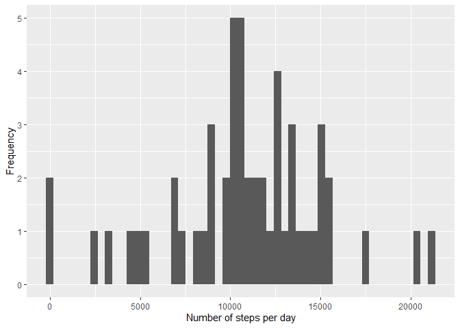
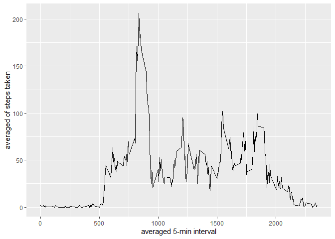
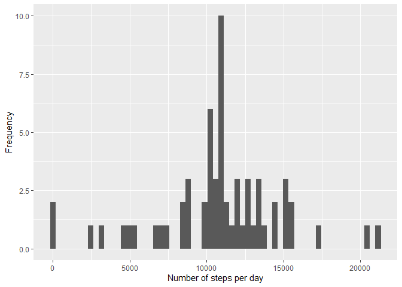
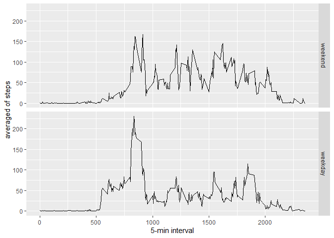

## Introduction
This is Peer Assesment 1 of Reproducible Research course. This assignment makes use of data from a personal activity monitoring device (Activity monitoring data). This device collects data at 5 minute intervals through out the day. The data consists of two months of data from an anonymous individual collected during the months of October and November, 2012 and include the number of steps taken in 5 minute intervals each day.

The dataset is stored in a comma-separated-value (CSV) file and there are a total of 17,568 observations in this dataset


## Loading and preprocessing the data
Loading packages

```r
library(ggplot2)
```
I edit my local time to use weekdays in English, if you local time is in English omit this step

```r
localtime <- Sys.getlocale("LC_TIME")#my local time
Sys.setlocale("LC_TIME","C") #Set local time to English
```

```
## [1] "C"
```
Loading the data

```r
activity <- read.csv("activity.csv")
activity$date <- as.Date(activity$date, "%Y-%m-%d")
summary(activity)
```

```
##      steps             date               interval     
##  Min.   :  0.00   Min.   :2012-10-01   Min.   :   0.0  
##  1st Qu.:  0.00   1st Qu.:2012-10-16   1st Qu.: 588.8  
##  Median :  0.00   Median :2012-10-31   Median :1177.5  
##  Mean   : 37.38   Mean   :2012-10-31   Mean   :1177.5  
##  3rd Qu.: 12.00   3rd Qu.:2012-11-15   3rd Qu.:1766.2  
##  Max.   :806.00   Max.   :2012-11-30   Max.   :2355.0  
##  NA's   :2304
```

## What is mean total number of steps taken per day?
    
### (1) Calculate the total number of steps taken per day

```r
daysteps <- aggregate(steps ~ date, activity, sum, na.rm=TRUE)
head(daysteps)
```

```
##         date steps
## 1 2012-10-02   126
## 2 2012-10-03 11352
## 3 2012-10-04 12116
## 4 2012-10-05 13294
## 5 2012-10-06 15420
## 6 2012-10-07 11015
```

### (2) Make a histogram of the total number of steps taken each day

```r
plot1 <- ggplot(daysteps, aes(x=steps)) + 
                geom_histogram(bins=nrow(daysteps)) +
                xlab("Number of steps per day") + ylab("Frequency")
plot1 
```

<!-- -->


### (3) Calculate and report the mean and median of the total number of steps taken per day

```r
stat_steps <- summary(daysteps$steps)[3:4] 
stat_steps
```

```
##   Median     Mean 
## 10765.00 10766.19
```
the firts value of stat_steps is the median and the second the mean


## What is the average daily activity pattern?

### (1) Calcular the averaged of 5-minute inteval

```r
stepsinterval <- aggregate(steps ~ interval, activity, mean, na.rm=TRUE)
head(stepsinterval)   
```

```
##   interval     steps
## 1        0 1.7169811
## 2        5 0.3396226
## 3       10 0.1320755
## 4       15 0.1509434
## 5       20 0.0754717
## 6       25 2.0943396
```


### (2) Make a time series plot (i.e. type = "l") of the 5-minute interval (x-axis) and the average number of steps taken, averaged across all days (y-axis)

```r
plot2 <- ggplot(stepsinterval, aes(x=interval, y=steps)) + 
    geom_line() +
    xlab("averaged 5-min interval") + ylab("averaged of steps taken")
plot2 
```

<!-- -->


### (3) Which 5-minute interval, on average across all the days in the dataset, contains the maximum number of steps?

```r
maxStepsbyInterval <- stepsinterval[which.max(stepsinterval[,2]),1]    
maxStepsbyInterval    
```

```
## [1] 835
```
the 5 minute interval that contains the maximum number of steps is 835


## Imputing missing values

### (1) Calculate and report the total number of missing values in the dataset (i.e. the total number of rows with NAs)

```r
NA_total <- sum(is.na(activity$steps))
NA_total
```

```
## [1] 2304
```

### (2) Devise a strategy for filling in all of the missing values in the dataset. The strategy does not need to be sophisticated. For example, you could use the mean/median for that day, or the mean for that 5-minute interval, etc.

```r
changeNAs <- function(x){ 
    interSte <- aggregate(x[,1]~ x[,2], x, mean, na.rm=TRUE)
    id.na <- which(is.na(x[,1]))
    change <- x[,1]
    for(i in 1:length(id.na)){
        inter <- x[id.na[i],2]
        change[id.na[i]] <- interSte[which(interSte[,1]==inter),2] 
    }
    change
}
```
Here, I create the function changeNAs that get a data.frame with two columns, the firts contains the NAs value and the second contain the values that help get a mean value to firts column.


### (3) Create a new dataset that is equal to the original dataset but with the missing data filled in.

```r
activity_notNas <- activity
activity_notNas$steps <- changeNAs(activity[, c("steps","interval")])
summary(activity_notNas)
```

```
##      steps             date               interval     
##  Min.   :  0.00   Min.   :2012-10-01   Min.   :   0.0  
##  1st Qu.:  0.00   1st Qu.:2012-10-16   1st Qu.: 588.8  
##  Median :  0.00   Median :2012-10-31   Median :1177.5  
##  Mean   : 37.38   Mean   :2012-10-31   Mean   :1177.5  
##  3rd Qu.: 27.00   3rd Qu.:2012-11-15   3rd Qu.:1766.2  
##  Max.   :806.00   Max.   :2012-11-30   Max.   :2355.0
```

### (4) Make a histogram of the total number of steps taken each day and Calculate and report the mean and median total number of steps taken per day. Do these values differ from the estimates from the first part of the assignment? What is the impact of imputing missing data on the estimates of the total daily number of steps?

```r
StepsDayNotNA <- aggregate(steps ~ date, activity_notNas, sum)    
plot3 <- ggplot(StepsDayNotNA, aes(x=steps)) + 
    geom_histogram(bins=nrow(StepsDayNotNA)) +
    xlab("Number of steps per day") + ylab("Frequency")
plot3 
```

<!-- -->


Calculating mean and median of Steps per day change the NAs by mean values of interval 5-minute.

```r
stat_steps_not_nas <- summary(StepsDayNotNA$steps)[3:4] 
stat_steps_not_nas #change NAs
```

```
##   Median     Mean 
## 10766.19 10766.19
```

```r
stat_steps #ignoring NAs
```

```
##   Median     Mean 
## 10765.00 10766.19
```
The mean not changed with replacement of NAs values, while the median increses 1%.


## Are there differences in activity patterns between weekdays and weekends?

### (1) For this part the weekdays() function may be of some help here. Use the dataset with the filled-in missing values for this part.

```r
weekday <- weekdays(activity_notNas$date) #get weekdays
activity_notNas$weekday <- weekday #associated weekdays
summary(activity_notNas)
```

```
##      steps             date               interval        weekday         
##  Min.   :  0.00   Min.   :2012-10-01   Min.   :   0.0   Length:17568      
##  1st Qu.:  0.00   1st Qu.:2012-10-16   1st Qu.: 588.8   Class :character  
##  Median :  0.00   Median :2012-10-31   Median :1177.5   Mode  :character  
##  Mean   : 37.38   Mean   :2012-10-31   Mean   :1177.5                     
##  3rd Qu.: 27.00   3rd Qu.:2012-11-15   3rd Qu.:1766.2                     
##  Max.   :806.00   Max.   :2012-11-30   Max.   :2355.0
```

### (2) Create a new factor variable in the dataset with two levels – “weekday” and “weekend” indicating whether a given date is a weekday or weekend day.

```r
id.weekend <- grepl("Saturday|Sunday", activity_notNas$weekday)
activity_notNas$week <- factor(ifelse(id.weekend==TRUE, "weekend", "weekday"), levels=c("weekend", "weekday"))
summary(activity_notNas)
```

```
##      steps             date               interval        weekday         
##  Min.   :  0.00   Min.   :2012-10-01   Min.   :   0.0   Length:17568      
##  1st Qu.:  0.00   1st Qu.:2012-10-16   1st Qu.: 588.8   Class :character  
##  Median :  0.00   Median :2012-10-31   Median :1177.5   Mode  :character  
##  Mean   : 37.38   Mean   :2012-10-31   Mean   :1177.5                     
##  3rd Qu.: 27.00   3rd Qu.:2012-11-15   3rd Qu.:1766.2                     
##  Max.   :806.00   Max.   :2012-11-30   Max.   :2355.0                     
##       week      
##  weekend: 4608  
##  weekday:12960  
##                 
##                 
##                 
## 
```

### (3) Make a panel plot containing a time series plot (i.e. type = "l") of the 5-minute interval (x-axis) and the average number of steps taken, averaged across all weekday days or weekend days (y-axis). See the README file in the GitHub repository to see an example of what this plot should look like using simulated data.
#preparing the data

```r
steps_week_interval <- aggregate(steps ~ interval + week, activity_notNas, mean)
head(steps_week_interval)
```

```
##   interval    week       steps
## 1        0 weekend 0.214622642
## 2        5 weekend 0.042452830
## 3       10 weekend 0.016509434
## 4       15 weekend 0.018867925
## 5       20 weekend 0.009433962
## 6       25 weekend 3.511792453
```
plot

```r
plot4 <- ggplot(steps_week_interval, aes(x=interval, y=steps)) + 
    geom_line() +
    facet_grid(week~.) +
    xlab("5-min interval") + ylab("averaged of steps")
plot4 
```

<!-- -->
